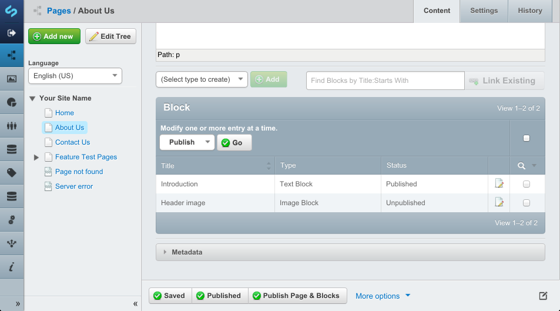
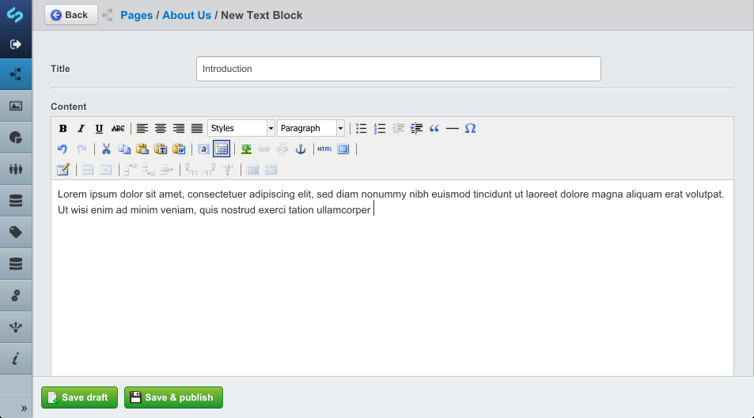
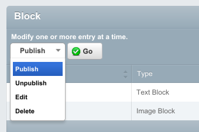
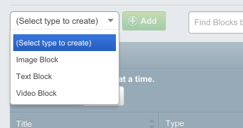

# Page-Blocks for SilverStripe

**IMPORTANT:** This module is currently work-in-progress and is subject to major changes or refactoring. Here's the current [TODO](TODO.md).

Please feel free to create pull-requests (especially for things in the TODO) or open issues with new ideas/requests.

## What is this?
Page-Blocks is a Module that adds content to a SilverStripe page in a modular way. Ever had a client that wanted some text, followed by a gallery, some more text and then a video?

You can do some of these things by allowing the user to insert videos and images directly into the content-editor (TinyMCE), but you'll lose control over the website-design.

The goal of this module is to allow flexible page-designs, while giving you full control over the design of the content. It's also great for single-page websites.

This module should be light-weight and extensible. We provide the backend integration, while **you** have to care about the frontend (we won't ship another gallery module). This isn't a all-round carefree package, but we provide some basic templates and (hopefully) a good documentation. 

## Requirements

#### Mandatory
 - [SilverStripe 3.1 or 3.2](https://docs.silverstripe.org/en/3.2/getting_started/composer/)
 - [GridField Bulk Editing Tools](https://github.com/colymba/GridFieldBulkEditingTools)
 - [GridField Extensions](https://github.com/silverstripe-australia/silverstripe-gridfieldextensions)

#### Optional (for a better experience)
These will be installed when installing the module via composer.

 - [sortablefile](https://github.com/bummzack/sortablefile) (attach many images and sort them with drag'n'drop)
 - [Better Buttons for GridField](https://github.com/unclecheese/silverstripe-gridfield-betterbuttons) (better buttons in your gridfield records. Allows you to save/publish directly within the blocks instead of using the bulk-manager actions).

## Installation

Use [composer](https://getcomposer.org/) to install the module and all its dependencies.

    composer require bummzack/page-blocks
    
If the above fails (composer complains about no matching packages when resolving requirements), then open up your `composer.json` file and add `"minimum-stability": "dev"` in the "root" of the JSON structure: 

    {
        "minimum-stability": "dev",
        ... 
    }
    
After doing so, run the composer require command again and it should successfully install the module and all requirements.
    
If you don't use composer, make sure you install at least the modules that are listed as "mandatory" under **Requirements**

After installing, make sure you rebuild the database and flush the cache (`dev/build?flush=1`).

**Important:** Your CMS won't change at all after the installation. You first have to configure the module. Read on.

## Configuration

The most important step is to add the `PageBlocks` extension to your page-types. It's up to you to decide which page-type should have blocks. For example you could create a custom Page named `BlockPage`. Here's a complete class listing for such a page:

```php
<?php
class BlockPage extends Page
{
    private static $description = 'A page with several content-blocks';
    
    private static $extensions = array(
        'PageBlocks'
    );
}

class BlockPage_Controller extends Page_Controller
{
    
}
```

Yep, that's it. Now you can create a new `BlockPage` in the CMS and add content-blocks to it. Of course you can also apply the extension via `config.yml` (even to existing page-types). Here's how you would add blocks to your `Page` class:

```yml
# put this in your mysite/_config/config.yml
Page:
  extensions:
    - PageBlocks
```

#### Overriding some of the defaults

To disable the "Publish Page & Blocks" Button in the CMS:
```yml
PageBlocks:
  allow_publish_all: false
```

To customize the video-block aspect-ratios and player appearance. In this example we configure several aspect-ratios to choose from and set the player controls to red (only works with the vimeo player).

```yml
VideoBlock:
  player_color: 'ff0000'
  aspect_ratios:
    - '0' # Automatic
    - '21/9' # Cinemascope
    - '16/9'
    - '8/5'
    - '4/3'
```

### Specify which blocks can be added to a page

Imagine that there are two different Page-types. One page can only have *Text-* and *Video-Blocks* attached, the other page should only have *Text-* and *Image-Blocks* as valid options.

The provided `GridFieldConfig_BlockEditor` has a method `setAllowedBlocks` which lets you specify the blocks that can be created on a per-gridfield basis.
This is also being used by the `PageBlocks` Extension.

Here's an example, where we limit the allowed blocks to just `ImageBlock` and `TextBlock`:

```php
public function getCMSFields()
{
    $fields = parent::getCMSFields();

    // get the Blocks GridField
    if ($blocks = $fields->fieldByName('Root.Main.Blocks')) {
        // Restrict the types of blocks that can be added to this page
        $blocks->getConfig()->setAllowedBlocks(array(
            'ImageBlock', 'TextBlock'
        ));
    }

    return $fields;
}

```


## Templates
There are example templates for all the blocks available in the `page-blocks/templates/Blocks` directory. Feel free to copy the entirey `Blocks` directory to your `themes/<themename>/templates` or into your `mysite/templates` folder so that you can customize them to your liking.

To output your blocks in your page templates, do something like this:
```html
<% loop $Blocks %>
<section class="block $CSSClass">
	<h2>$Title</h2> <!-- The block title is being used as section header -->
	$HTML <!-- This will be rendered with the specific block template -->
</section>
<% end_loop %>
```

There's also an include file you can use to output all the blocks. It can be found at `page-blocks/templates/Includes/Blocks.ss`.

## Adding a Block to multiple Pages

Use the provided `VirtualBlock` to create virtual versions of an existing block.

## Writing custom Blocks

Writing your custom Blocks is super easy (just subclass `Block`). Let's assume you want to create some sort of "Embed-Block" that allows you to embed external content via iframe or similar:

```php
<?php
class EmbedBlock extends Block
{
    private static $db = array(
        'EmbedCode' => 'Text'
    );
    
    public function getCMSFields()
    {
        $fields = parent::getCMSFields();
        $fields->addFieldToTab('Root.Main', 
            new TextareaField('EmbedCode', 'Embed code'));
        $this->extend('updateCMSFields', $fields); // be nice to extensions
        return $fields;
    }
}
```

Then also create a matching template (named `EmbedBlock.ss`) in your template folder. The template code could look like this:

```yml
<%-- Well, this template is rather simple --%>
$EmbedCode.RAW
```

Then just run `dev/build?flush=1` and you're set. The EmbedBlock should be available in the CMS via dropdown.

## Screenshots







